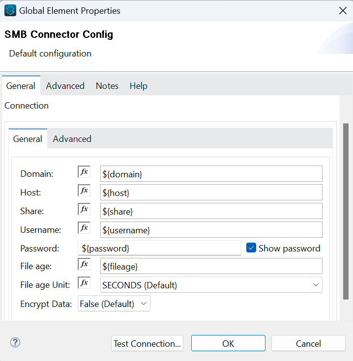
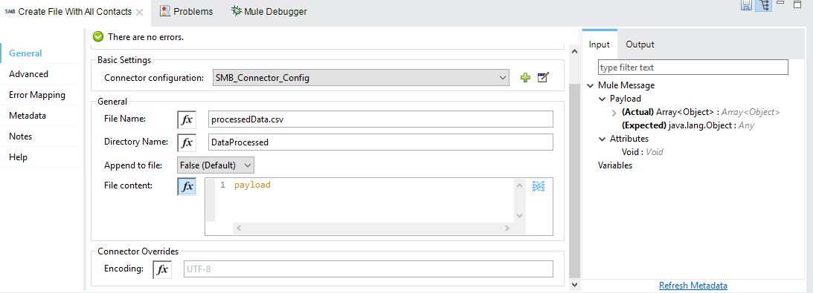

= SMB Connector

== ⦁    DOCUMENT REVISION HISTORY

[%header%autowidth.spread]
|===
|Version  |Release Date |Revised by |Comments/ Indicate Sections Revised
|3.0.0 |2022-09 |Connector Development Team |
|3.1.0 |2023-05 |Connector Development Team |
|===

== ⦁    INTRODUCTION
⦁   *Purpose*

This specification document outlines the instructions for using SMB Connector operations (such as create directory, list directory contents, delete a directory, read a file, write a file, delete a file,move a file) against a Windows SMB share.

⦁   *Background*

SMB is a network protocol used by Windows-based computers that allows systems within the same network to share files. It allows computers connected to the same network or domain to access files from other local computers as easily as if they were on the computer's local hard drive.

⦁   *Overview*

The Server Message Block Protocol (SMB protocol) is a client-server communication protocol used for sharing access to files and other resources on a network. Anypoint Connector for SMB provides the capability to perform operations (such as create directory, list directory contents, delete a directory, read a file, write a file, delete a file, move a file) against a Windows SMB share.

*A high-level diagram of the architecture is shown below*

== ⦁	LIST OF OPERATIONS SUPPORTED BY THE SMB CONNECTOR:

[%header%autowidth.spread]
|===
|Sr.No |Business Function |Operations |Description |Inbound |Outbound
|1 |Directory create |POST Request |Create a new directory on the SMB share.|Required field is *Folder Name* |Return boolean response(true: Directory created, false: Directory not created)
|2 |Directory list |GET Request |List the contents of a directory on the SMB share|*Folder Name* and *Wildcard* are optional parameters | Return Array of Strings
|3 |Directory delete |DELETE Request |Delete a directory from the SMB share |Required field is *Directory Name* |Return boolean response(true: Directory deleted, false: Directory not deleted)
|4 |File write |POST Request |Writes data out to a file |Required field is *File Name* |Return boolean response(true: Data created, false: Data not created)
|5 |File read |GET Request |Reads the contents of a file from the SMB share |Required field is *File Name* |Return binary response
|6 |File delete |DELETE Request |Delete a directory from the SMB share |Required field is *File Name* |Return boolean response(true: File deleted, false: File not deleted)
|7 |File Move | GET Request |Moves a file from source location in share to destination location of same share|  Required field is *File Name* | Return boolean response(true: File moved, false: File not moved)
|===

==  ⦁ DIRECTORY LIST

- Use * has wildcard to get all list for folder and files present.

- Wildcard supports all DOS style wildcard filter.

==  ⦁   FILE MOVE
- File name - Name of the file to be moved.

- Source Directory - Location where file is present. (If null , will consider root location as default)

- Destination Directory - Location where file is to be moved.(If null , will consider root location as default)

- RenameTo - Will rename the file name after moving in destination directory. (If null , original file name will be preserved)

- Create target directory - If true it will check if directory exist or not , if not will create the destination directory. (Parent directory should be present if not it will throw an error OBJECT_PATH_NOT_FOUND) Example -
> if user has given this path in destination directory a/b/c and create target directory is true in that case a/b should be present to create c.

- Overwrite - If true it will check for the file to  overwrite , if not found will create a file. If false file should not be present with the same name.

- Auto Delete - If true , it will delete from source and if false it won't delete.

- Source Access Mask - Supported access rights for source file.

- Destination Access Mask - Supported access rights for destination file.

==  ⦁   CONFIGURATION FOR SMB CONNECTOR
To use SMB Connector, you will require the following configuration properties.

    Domain: Enter a Windows domain for the user to log in with.

    Host: Hostname of server hosting SMB share.

    Share: Named path of the SMB share.

    Username: Enter the username to log in with. Setting the value to "guest" indicates that guest connectivity should be used and no password is required. Setting the value to "anonymous" indicates that anonymous connectivity should be used and no password is required. These values are reserved to indicate these access types.

    Password: Enter the corresponding password.

    Connection timeout: Timeout for connection, in Seconds(Default).

    File age: Age of file required to perform operations on it, in Seconds(Default).

    Socket Timeout: Timeout for socket, in Seconds(Default).

    Encrypt Data: Boolean value for SMB traffic encryption, False(Default).

==  ⦁   TO CONNECT IN DESIGN CENTER

⦁ In Design Centre, click Create and choose Mule Application.

⦁ Click a trigger such as an HTTP Listener or the Scheduler trigger.

image:img/HTTP_Listener_DesignCenter1.png[]

⦁ To create an HTTP global element for the connector, set these fields:

image:img/HTTP_Listener_DesignCenter.png[]

[%header%autowidth.spread]
|===
|Field |Description
|Protocol |Protocol selected for the HTTP connector, it can be HTTP or HTTPS (secure).
|Host |IP address where your Mule application listens for requests.
|Port |Port address where your Mule application listens for requests.
|Base Path |Path where your Mule application listens for requests.
|===

⦁	Select the plus sign to add a component.

⦁	Select the SMB Connector as a component.

⦁	Select an operation:

⦁	Configure the Global element for the connector:

⦁	Fill the required parameters (if any) for the above selected operation.

==  ⦁   USE CASE – CONNECTIVITY WITH SALESFORCE

This use-case demonstrates the interaction between SMB and Salesforce systems using SMB connector. It utilises POST, GET and DELETE operations connectors.

⦁ The flow gets created using "File Write" operation for creating the Employee details file, convert the file into csv format and create contact details of employee into Salesforce.

⦁ Once the Employee details created into Salesforce, retrieve it from Salesforce object and store into another csv file of another directory using "File Write" and "Directory Create" components respectively.

⦁ Then delete the employee details first from Salesforce after that delete the file from directory.

*For running this use-case we need following configurations as prerequisites:*

⦁ Drag and drop an HTTP Listener in the canvas.

⦁ In the Listener properties, give a path you want to use to trigger the listener.

⦁ Add a new Configuration as follows,

image:img/HTTP_Listener_Config.png[]

⦁ Test the connection and click on Okay.

⦁ Make sure your mule palette has Salesforce and SMB modules. If you do not have Salesforce module in your palette, go to add module -> Salesforce and drag it to your palette.

⦁ Now add configurations for SMB.

⦁ Go to global-configurations.xml global elements -> create -> Connector Configuration -> SMB Configuration

⦁ Add following properties.

    Domain :
    Host :
    Share :
    Username :
    Password :
    File age :
    Connection Timeout :
    Socket Timeout:
    Encrypt Data:

image:img/global_config_timeout.png[]

image:img/global_config_advanced.png[]

⦁	Add Salesforce configuration.

⦁	Go to global-configurations.xml -> global elements -> create -> Connector Configuration -> Salesforce Configuration

⦁	Add following properties

⦁	Create a flow with the components displayed in the image below:

image:img/delete_employee_flow.png[]

⦁	*Individual mappings for each component are illustrated in below screenshots:*

*-> Create Employee File*

*-> Directory create*

*-> File Read*

*-> Transform File*

*-> Create Employee Contacts into Salesforce Contact Object*

   %dw 2.0
output application/java
---
payload map ((item, index) ->
{
	LastName: item.LastName,
	FirstName: item.FirstName,
	Phone: item.Phone,
	Email: item.Email
}
)

*-> Retrieve all contact details from Salesforce*

*-> Transform Salesforce data into csv*

*-> Create details into new file of another directory*

⦁   *deleteFlow*

*-> Read the details from file*

*-> Retrieve employee details from Salesforce by Name*

*-> Delete salesforce details by Contact Id*

   %dw 2.0
output application/java
---
(payload map ((item, index) ->
{
	Id: item.Id,
	Name:item.Name
})).Id

*-> Delete File*

⦁   *Install SMB Connector in Anypoint Studio*

link:user-manual.adoc[]

⦁	*About Connector Namespace and Schema*

When designing your application in Studio, drag and drop the connector in your canvas and the Namespace and schema get populated in the config file as below,

*Namespace:*   http://www.mulesoft.org/schema/mule/smb

*Schema Location:*  http://www.mulesoft.org/schema/mule/smb/current/mule-smb.xsd

