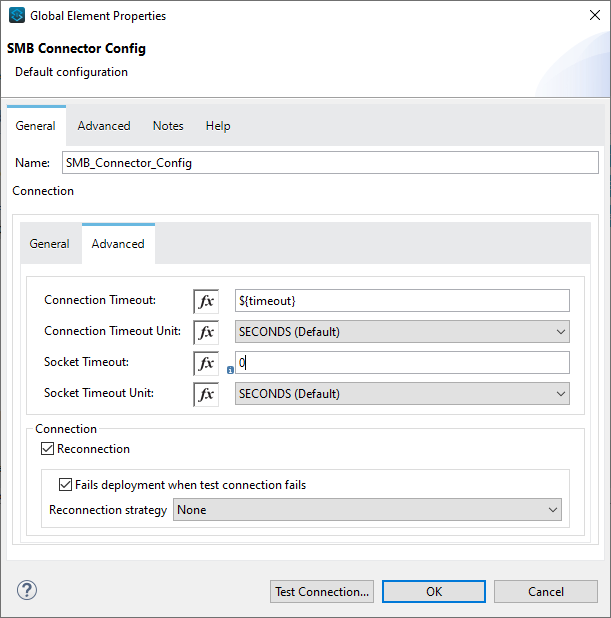
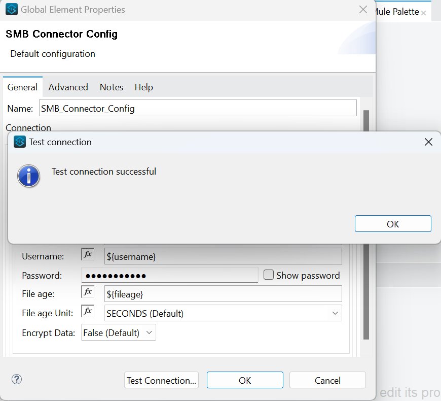
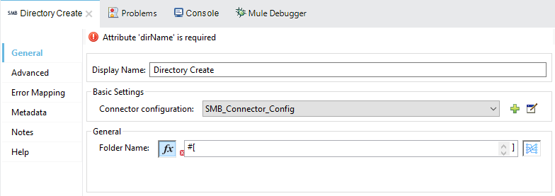

= SMB Connector

MuleSoft Certified

== About SMB

*SMB* Stands for "Server Message Block." *SMB* is a network protocol used by Windows-based computers that allows systems within the same network to share files

== About SMB Connector

Anypoint Connector for SMB provides the capability to perform operations (such as create directory, list directory contents, delete a directory, read a file, write a file, delete a file,move a file) against a Windows SMB share.

== Prerequisites
This document assumes that you are familiar with Mule, Anypoint Connectors,
Anypoint Studio Essentials, Mule flows, and Mule Global Elements.

To use SMB connector, you need

* Anypoint Studio version 7.

== Mule Compatibility

[width="100%", options="header"]
|=======
|Application/Service |Version
|Mule Runtime |4.2.x and later
|Anypoint Studio | 7.3.x and later
|=======

== What's New in this Connector

* This SMB connector 2.1.1 is compatible with Mule 4.

== To Install this Connector in Anypoint Studio 7
You can use SMB Connector in Anypoint Studio by adding it as a dependency in your Mule application.

. Open your Mule project in Anypoint Studio.
. Add the connector as a dependency in the pom.xml file:

```
<dependency>
    <groupId>com.mulesoft.connectors</groupId>
    <artifactId>mule-smb-connector</artifactId>
    <version>2.1.1</version>
    <classifier>mule-plugin</classifier>
</dependency>
```

When Studio has an update, a message displays in the lower right corner, which
you can click to install the update. After updating, update Maven pom.xml file dependencies to the new version.

== Configure in Studio

=== To Configure the Connector
* After adding connector dependency to Mule project, click on *Global Elements* tab at the base of the canvas.
* In the Global Mule Configuration Elements screen, click *Create*.
* In the Choose Global Type wizard, collapse connector configuration and select *'SMB Connector Config'* and click OK.


* The configuration parameters to configure is

+
[options="header",width="50%"]
|============
|Field Name         |Value
|Domain             |Enter a Windows domain for the user to log in with.
|Host               |Hostname of server hosting SMB share.
|Share              |Named path of the SMB share.
|Username           |Enter the username to log in with. Setting the value to "guest" indicates that guest connectivity should be used and no password is required. Setting the value to "anonymous" indicates that anonymous connectivity should be used and no password is required. These values are reserved to indicate these access types.
|Password           |Enter the corresponding password.
|File Age           |Age of file required to perform operations on it, in Seconds(Default).
|Connection Timeout |Timeout for connection, in Seconds(Default).
|Socket Timeout     |Timeout for the socket, in Seconds(Default).
|============
+

* Parameter values can be directly entered into the global configuration properties, or reference from a configuration file that contains these values.
Here we are adding values to application properties file and reference it using placeholders.

image::img/global_config.png[]



* Make a *Test Connection...* to check that the configuration is correct.



* On success, configuration is ready to use!

* SMB_Connector_Config configuration should look like below in Configuration XML:
+
```xml
    <smb:config name="SMB_Connector_Config" doc:name="SMB Connector Config" doc:id="d6b5ce20-7876-4bc5-8ad5-b0b8931590f1" >
		<smb:connection domain="${domain}" host="${host}" share="${share}" username="${username}" password="${password}" connectionTimeout="${timeout}" fileAge="${fileage}" fileAgeUnit="SECONDS" connectionTimeoutUnit="SECONDS" socketTimeout="30000" socketTimeoutUnit="SECONDS"/>
	</smb:config>
```


== ​To Create a Mule Project in Anypoint Studio 7

The SMB connector is an operation-based connector, which means that when you add the connector to your flow, you need to configure a specific operation the connector is intended to perform. Below is the *"Directory Create"* operation for better understanding.

* Create new Mule Application in Studio and configure *HTTP Listener* to port 8081.

image::img/HTTP_Listener_Config.png[]

* Add "/createDir" path to test the flow.


* Select *'Diretory Create'* operation from SMB connector, drag & drop it into canvas. Click on Get Directory Create operation.



* Select SMB configuration from drop down which was already configured previously in global elements, or if required new configuration can be added by clicking green plus (+) symbol.

image::img/global_config.png[]


* Make sure to test your connection, if you have add new connection details.
* Enter required details for *Directory Create* operation and save.


* Drag & drop *Transform Message* from Mule Palette, drag and drop it next to SMB Connector. Use the below DataWeave snippet to transform the response.
```
%dw 2.0
output application/json
---
payload

```
* Save the Mule project.
* Complete flow looks as below.


* Run the project as a Mule Application by right-clicking the project name in the Package Explorer, selecting Run As > Mule Application.
* Open Postman and check the response after entering the URL *http://localhost:8081/createDir?directoryName=Hello*. You should see the boolean response true. It means your folder is created with the name *Hello*.

```xml
<?xml version="1.0" encoding="UTF-8"?>

<mule xmlns:ee="http://www.mulesoft.org/schema/mule/ee/core" xmlns:smb="http://www.mulesoft.org/schema/mule/smb"
	xmlns:http="http://www.mulesoft.org/schema/mule/http"
	xmlns="http://www.mulesoft.org/schema/mule/core" xmlns:doc="http://www.mulesoft.org/schema/mule/documentation" xmlns:xsi="http://www.w3.org/2001/XMLSchema-instance" xsi:schemaLocation="http://www.mulesoft.org/schema/mule/core http://www.mulesoft.org/schema/mule/core/current/mule.xsd
http://www.mulesoft.org/schema/mule/http http://www.mulesoft.org/schema/mule/http/current/mule-http.xsd
http://www.mulesoft.org/schema/mule/smb http://www.mulesoft.org/schema/mule/smb/current/mule-smb.xsd
http://www.mulesoft.org/schema/mule/ee/core http://www.mulesoft.org/schema/mule/ee/core/current/mule-ee.xsd">
	<flow name="directoryCreateFlow" doc:id="1249e166-fa74-4803-b3e8-87851b95e1a3" >
		<http:listener doc:name="8081/createDir" doc:id="787e4cd9-386f-4cba-a9dd-8afa6d14a064" config-ref="HTTP_Listener_config" path="/createDir"/>
		<smb:directory-create doc:name="Directory Create" doc:id="81b39a90-e969-4e2d-806c-064b85c3c98f" config-ref="SMB_Connector_Config" dirName="#[attributes.queryParams.directoryName]"/>
		<ee:transform doc:name="DW Java to Json" doc:id="7a9bd494-a282-48ed-abca-791f3a519a26" >
			<ee:message >
				<ee:set-payload ><![CDATA[%dw 2.0
output application/json
---
payload]]></ee:set-payload>
</ee:message>
</ee:transform>
</flow>
</mule>
```

== See Also

link:release-notes.adoc[]


